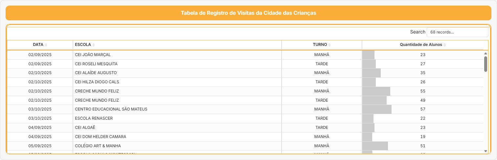

# 📊 Dashboard – Visitas à Cidade da Criança (Página 1)

Este espaço integra o planner com o **Dashboard de Visitas** da Cidade da Criança de Fortaleza.

> **Observação:** O dashboard contabiliza visitas a partir de **setembro/2025**, quando as visitas passaram a ser homologadas em planilhas.

---

## 🔗 Fonte de Dados

- Planilha de registros (Google Sheets)  
- Atualização contínua  
- Integração com o **Observa Infância Viva**

---

## 🖼 Tabela de Registro de Visitas da Cidade das Crianças

A imagem abaixo apresenta a **tabela completa de registros**, com data, escola, turno e quantidade de alunos.

---

## 📈 Síntese dos Resultados (Análise Consolidada)

Os resultados são mensuráveis e demonstram o impacto crescente da Cidade da Criança:

- Entre **1º de setembro e 22 de outubro de 2025** foram registrados:  
  - **1.624 participantes**  
  - em **134 atividades pedagógicas**  
  - realizadas em **24 dias**  
  - envolvendo cerca de **39 escolas**  

- No eixo **saúde**, em **18 de outubro de 2025** ocorreu um **mutirão de vacinação** com **199 doses aplicadas**:  
  - Influenza: **61**  
  - Hepatite B: **28**  
  - Febre Amarela: **27**  
  - DT: **25**  

- A **distribuição por turno** no período foi:  
  - Manhã: **868** participantes  
  - Tarde: **516** participantes  
  - Dia completo: **240** participantes  

- Quanto ao **fluxo geral de visitas do parque**, estima-se:  
  - **57.920 visitantes** no período de **10/08 a 10/10**;  
  - Subperíodo **23/09 a 10/10**: **14.320 visitantes**;  
  - Subperíodo **11/10 a 21/10**: **11.420 visitantes**, incluindo estimativa conservadora de **> 5.000 visitantes** no **Domingo do Dia das Crianças**;  
  - O acumulado atingiu **69.930 visitantes** até **23/10/2025**.  

Esses indicadores alimentam o **Observa Infância Viva** e orientam:

- ajustes de **sombreamento** e **plantio**;  
- definição de **programação** pedagógica e cultural;  
- estratégias de **mobilidade ativa** e acessibilidade;  

e evidenciam **viabilidade, impacto e integração intersetorial** da Cidade da Criança.

---

<!-- ## 📝 Minhas leituras dos dados

- O que os números mostram sobre o uso da Cidade da Criança:  
- Períodos com maior concentração de visitas:  
- Tipos de instituições que mais frequentam:  
- Possíveis ajustes no planejamento das próximas visitas: -->
