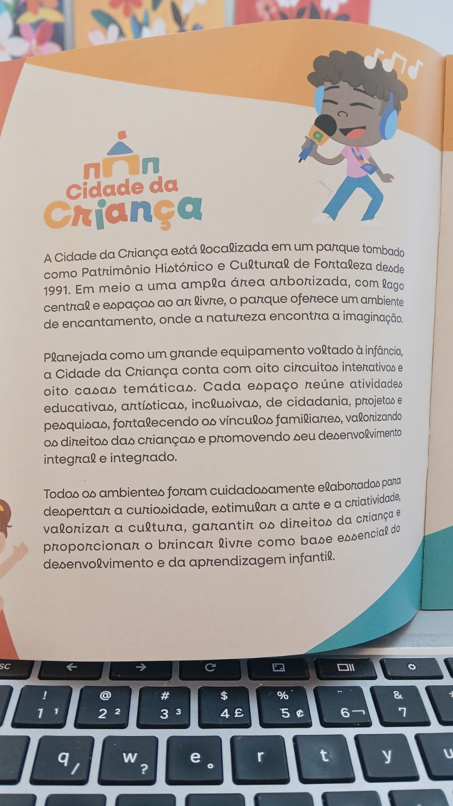

# Apresentação Cidade da Criança

> A Cidade da Criança está localizada em um parque tombado como Patrimônio Histórico e Cultural de Fortaleza desde 1991. Em meio a uma ampla área arborizada, com lago central e espaços ao ar livre, o parque oferece um ambiente de encantamento, onde a natureza encontra a imaginação.

> Planejada como um grande equipamento voltado à infância, a Cidade da Criança conta com oito circuitos interativos e oito casas temáticas. Cada espaço reúne atividades educativas, artísticas, inclusivas, de cidadania, projetos e pesquisas, fortalecendo os vínculos familiares, valorizando os direitos das crianças e promovendo seu desenvolvimento integral e integrado.

> Todos os ambientes foram cuidadosamente elaborados para despertar a curiosidade, estimular a arte e a criatividade, valorizar a cultura, garantir os direitos da criança e proporcionar o brincar livre como base essencial do desenvolvimento e da aprendizagem infantil.

>OBS: Seguir fielmente o modelo da foto!