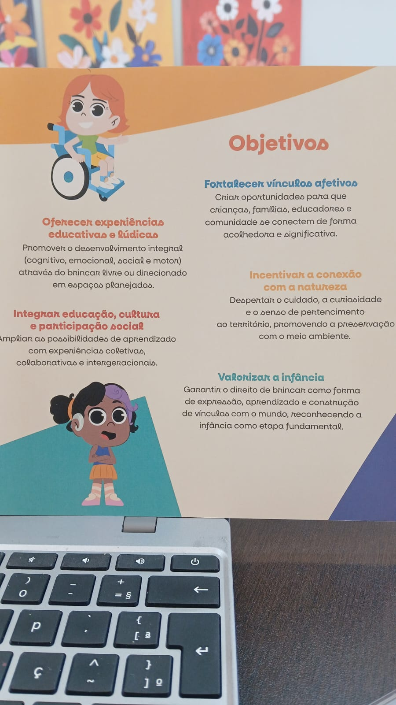

# Objetivos da Cidade das Crianças

## Fortalecer Vínculos Afetivos
> "Criar oportunidades para que crianças, famílias, educadores e comunidade se conectem de forma acolhedora e significativa"
## Oferecer Experiências educativas e lúdicas
> "Criar oportunidades para que crianças, famílias, educadores e comunidade se conectem de forma acolhedora e significativa"
## Incentivar a conexão com a natureza
> "Despertar o cuidado, a curiosidade e o senso de pertencimento ao território, promovendo a preservação com o meio ambiente"
## Integrar educação, cultura e participação social
> "Ampliar as possibilidades de aprendizado com experiências coletivas colaborativas e intergeracionais"
## Valorizar a infância
> "Garantir o direito de brincar como forma de expressão, aprendizado e construção de vínculos com o mundo, reconhecendo a infância como a etapa fundamental"

>OBS: Seguir fielmente o modelo da foto!