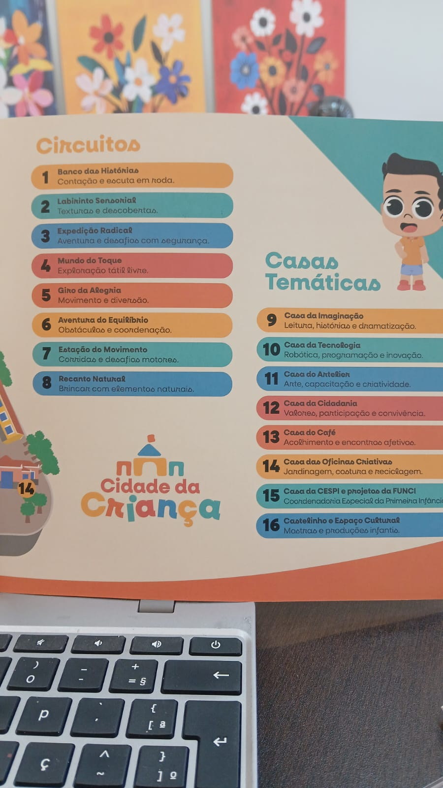

# 🎡 Os 8 Circuitos Interativos

1. **Banco das Histórias**  
   - Linguagem oral, imaginação, narrativas, roda de conversa.

2. **Labirinto Sensorial**  
   - Texturas, cores, percepção do corpo e do espaço.

3. **Expedição Radical**  
   - Desafios motores, coragem, superação de obstáculos.

4. **Mundo do Toque**  
   - Exploração tátil, formas, superfícies, materiais diversos.

5. **Giro da Alegria**  
   - Movimentos circulares, equilíbrio dinâmico, sistema vestibular.

6. **Aventura do Equilíbrio**  
   - Trilhas, rampas, coordenação motora, foco e atenção.

7. **Estação do Movimento**  
   - Corridas, brincadeiras ativas, autonomia corporal.

8. **Recanto Natural**  
   - Areia, elementos naturais, imaginação livre, sensação de natureza.

# 🏠 Casas Temáticas

- **Casa da Imaginação** – histórias, leitura, faz-de-conta.  
- **Casa da Tecnologia e Observatório da Primeira Infância** – inovação, dados, linguagens digitais.  
- **Casa das Oficinas Criativas & CINE+** – arte, reciclagem, cinema, criação coletiva.  
- **Casa da CESPI e projetos da FUNCI** – primeira infância e proteção social.  
- **Atelier** – expressão artística, sensorialidade, fazer manual.  
- **Casa do Café** – acolhimento, convivência, pausa afetiva.  
- **Casa da Cidadania** – direitos, convivência, respeito, participação.  
- **Castelinho / Espaço Cultural** – exposições, memória, cultura.  
- **Casa da URBFOR e Bicicletário** – mobilidade, trilhas e estrutura de apoio.

>OBS: Seguir fielmente o modelo da foto!