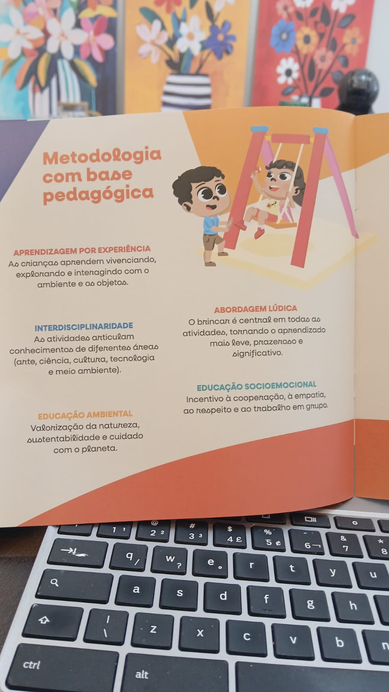

# Metodologia com base Pedagógica:

## Aprendizagem por Experiência
> "As crianças apendem vivenciando, explorando e interagindo com o ambiente e os objetos"
## Interdisciplinaridade
>"As atividades articulam conhecimentos de diferentes áreas (arte, ciência, cultura, tecnologia e meio ambiente)"
## Educação Ambiental
>"Valorização da natureza, sustentabilidade e cuidado com o planeta"
## Abordagem Lúdica
>"O brincar é central em todas as atividades, tornando o aprendizado mais leve, prazeroso e significativo
## Educação Socioemocional
>"Incentivo à cooperação, à empatia, ao respeito e ao trabalho em grupo"

