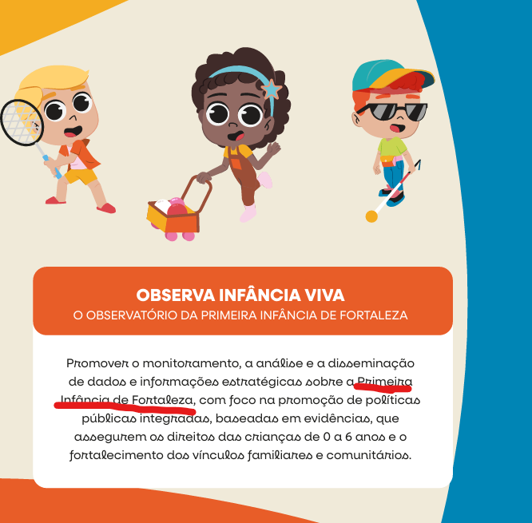
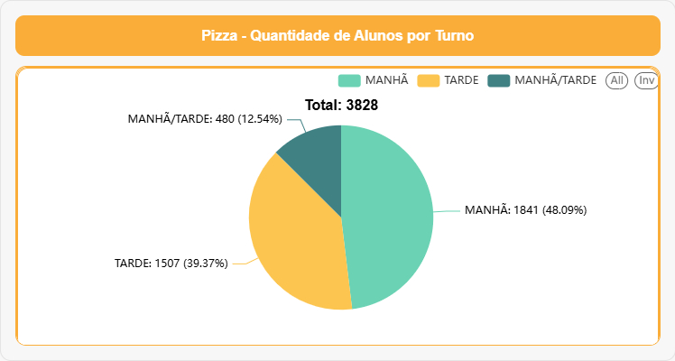
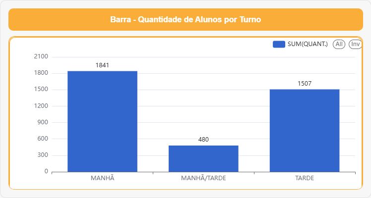
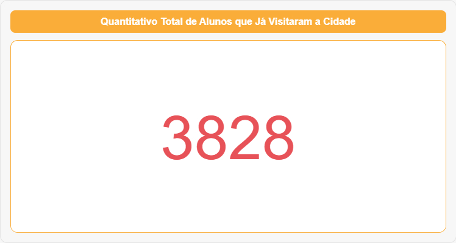
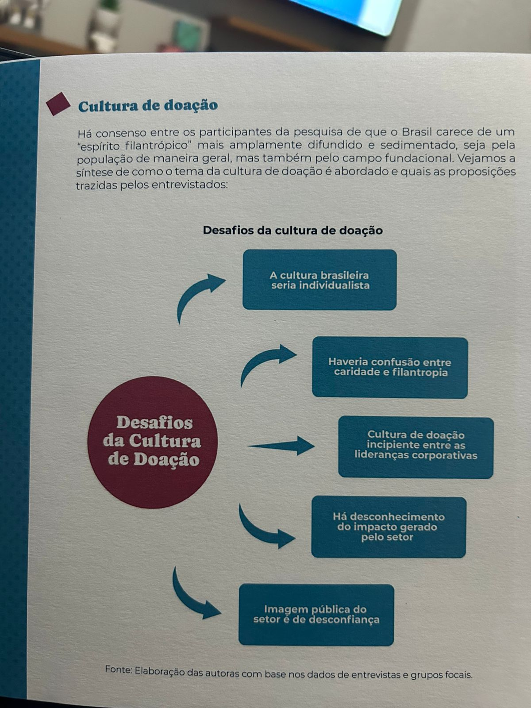

# 📊 Dashboard – Visitas à Cidade da Criança (Página 1)

> Promover o monitoramento, a análise e a disseminação  de dados e informações estratégicas sobre a **Primeira Infância de Fortaleza** e a **Cidade Das crianças**, com foco na promoção de políticas  públicas integradas, baseadas em evidências, que  assegurem os direitos das crianças de 0 a 6 anos e o  fortalecimento dos vínculos familiares e comunitários.

## Dados sobre as Visitas na Cidade das Crianças Só entre os dias **02/09/2025** e **28/11/2025**:

### Barra – Visitantes por Dia e por Turno

---

> Histórico de visitantes com gráfico de Linha
.png)

> Histórico de visitantes com gráfico de Barra
.png)

> Top 10 Escolas Visitantes com Mais Alunos

> Quantidade de Alunos por Turno

> Quantidade de Alunos por Turno

> Quantidade de Visitas por Turno

> Quantidade de Visitas por Turno

> Quantitativo Total de Alunos que Já Visitaram a Cidade

> Quantitativo Total de Visitas na Cidade

## Impacto da Política Pública: Cidade da Criança  
*(Período: Setembro, Outubro e Novembro)*

A Cidade da Criança consolida-se como **política pública estruturante de primeira infância**, promovendo acesso à natureza, à cultura, à ludicidade e a experiências pedagógicas qualificadas.  
Os indicadores referentes ao circuito interativo, no período de três meses, evidenciam **alcance, equidade e capilaridade** das ações.

---

### 1. Alcance Educacional e Territorial

Foram **108 escolas atendidas em três meses**, contemplando unidades municipais, estaduais, privadas e instituições parceiras.

O número expressivo de escolas demonstra:

- **Alta capilaridade territorial**, atingindo diferentes bairros e realidades socioeconômicas.  
- **Integração intersetorial** entre educação, cultura, primeira infância e assistência.  
- **Reconhecimento das escolas** sobre o valor pedagógico da experiência no parque.

> Este dado, por si só, posiciona a Cidade da Criança como **equipamento estratégico da política de educação integral**.

---

### 2. Impacto Direto nas Crianças

Foram **3.828 crianças atendidas** nos circuitos interativos.

Esse volume revela:

- **Uso intenso, contínuo e qualificado** dos espaços de brincar livre e de aprendizagem.  
- **Alta adesão de professores e escolas** aos circuitos sensoriais, motores, culturais e narrativos.  

As experiências ofertadas contribuem diretamente para:

- Desenvolvimento da **coordenação motora ampla e fina**;  
- **Autonomia e exploração** do espaço;  
- **Imaginação, linguagem e narrativa**;  
- Fortalecimento de **laços afetivos e de convivência**;  
- **Regulação emocional** a partir da natureza, do corpo em movimento e do brincar.

> Isso mostra que a Cidade da Criança é mais que um parque: é uma **plataforma pública de desenvolvimento infantil**.

---

### 3. Contribuição para as Políticas de Primeira Infância

Os indicadores reforçam a Cidade da Criança como **referência nacional** em:

#### ✔ Educação integral e baseada na natureza
- Brincar ao ar livre;  
- Experiências sensoriais e culturais;  
- Ambientes vivos, acolhedores e seguros.

#### ✔ Intersetorialidade real
- Atuação integrada de **CESPI, Gabinete da Primeira-Dama, SME, URBFOR, SEUMA, SDE, SEINFRA, Fecomércio, ENEL, SESC**, entre outras instituições, articuladas em torno de um **propósito comum**: a primeira infância.

#### ✔ Redução das desigualdades
- Equipamento **gratuito, central e acessível**, que oferece experiências de alta qualidade, comparáveis às das escolas mais estruturadas da cidade.  
- Amplia o acesso de crianças de territórios vulnerabilizados a **vivências culturais, pedagógicas e de lazer qualificadas**.

#### ✔ Política pública viva e cotidiana
- Não se configura como evento pontual, e sim como **espaço ativo e contínuo**, recomendado pelas escolas e com **fluxo crescente** de visitas.  

>colocar os 4 pontos na forma abaixo:

---

### 4. Legado Mensurável da Cidade da Criança

Os números demonstram:

- **Alta procura** e **impacto amplo** em apenas três meses;  
- **Confiança das redes de ensino** na proposta pedagógica e na segurança do equipamento.

Trata-se de um equipamento que:

- **Forma cultura de infância em Fortaleza**;  
- **Aproxima famílias e professores** em torno do direito de brincar;  
- **Promove saúde emocional** e vínculo com a natureza;  
- Gera **pertencimento e memória afetiva** nas crianças, famílias e profissionais.

> A Cidade da Criança já se evidencia como uma **política pública de referência**, sustentada por dados, experiência concreta e repercussão social.

---

### Síntese Institucional para Relatórios

> “Com **3.828 crianças** vivenciando os circuitos interativos e **108 escolas atendidas** em apenas três meses, a Cidade da Criança reafirma seu papel como **política pública estruturante da primeira infância em Fortaleza**.  
> O equipamento garante **acesso democrático ao brincar, à natureza, à cultura e às experiências pedagógicas de alta qualidade**, fortalecendo vínculos, aprendizagens e o desenvolvimento integral das crianças.”
