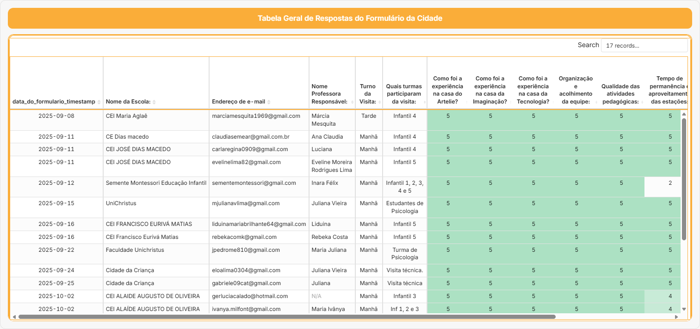
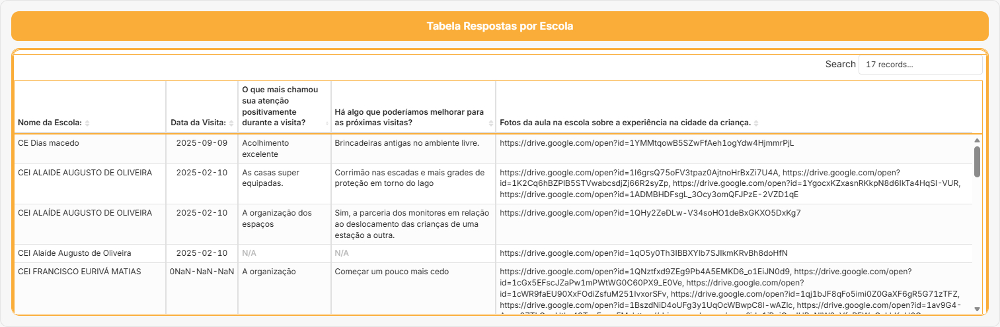
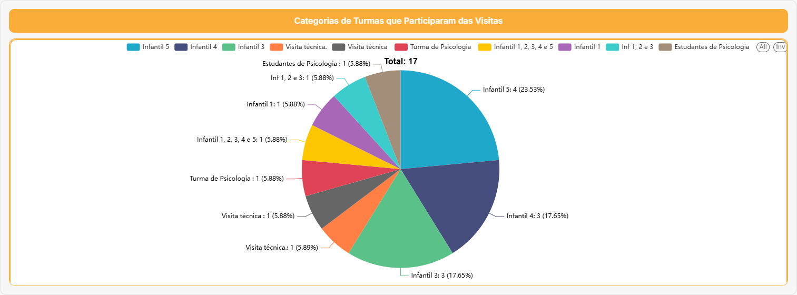
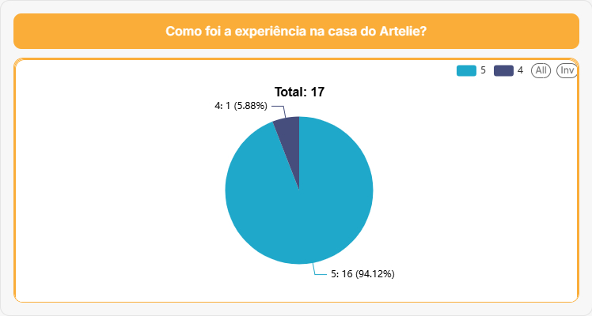
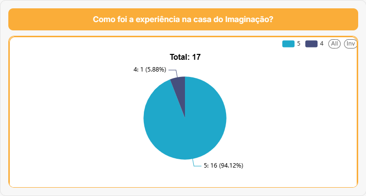
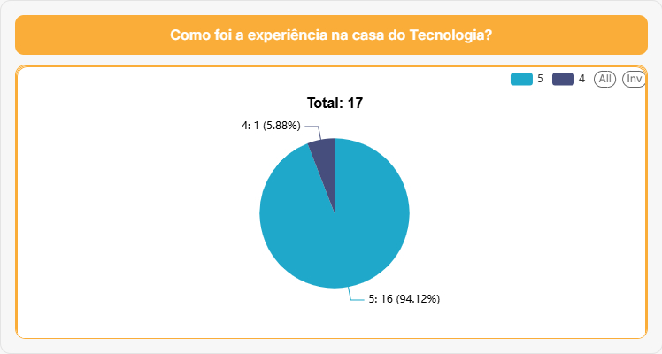
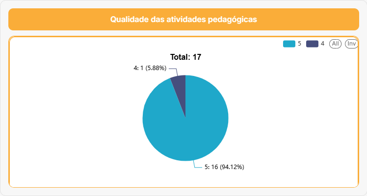
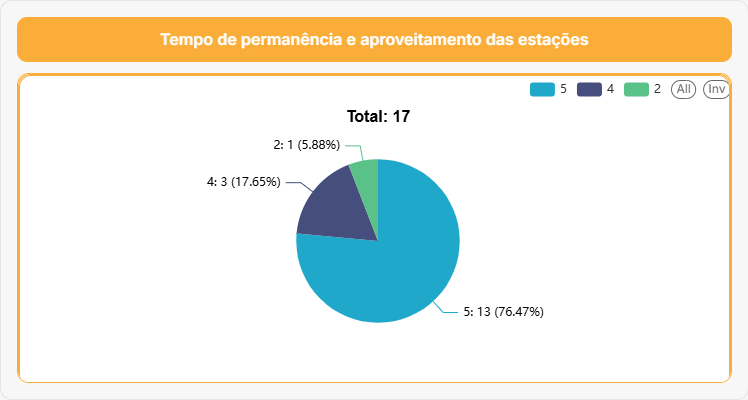
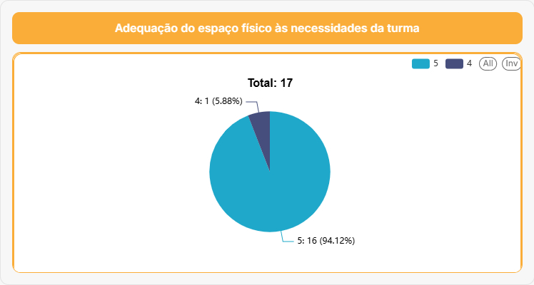

# 📊 Dashboard – Visitas à Cidade da Criança (Página 1)

Este espaço integra o planner com o **Dashboard de Visitas** da Cidade da Criança de Fortaleza.

> **Observação:** O dashboard contabiliza visitas a partir de **setembro/2025** pouco tempo após sua reabertura, e quando, quando as visitas passaram a ser homologadas em planilhas.

---

## 🔗 Fonte de Dados

- Formulários de avaliação
- Sistemas de planilha   
- Integração com o **Observa Infância Viva**

---

<!-- ## 🖼 Tabela de Registro de Visitas da Cidade das Crianças

A imagem abaixo apresenta a **tabela completa de registros**, com data, escola, turno e quantidade de alunos.

 -->

---

> Histórico de visitantes com gráfico de Linha
.png)

> Histórico de visitantes com gráfico de Barra
.png)

## 📈 Síntese dos Resultados (Análise Consolidada)

Os resultados são mensuráveis e demonstram o impacto crescente da Cidade da Criança:

## Entre **1º de setembro e 22 de outubro de 2025** foram registrados:  
  - **1.624 participantes**  
  - em **134 atividades pedagógicas**  
  - realizadas em **24 dias**  
  - envolvendo cerca de **39 escolas**  

## Quando ampliamos os dados para todas as visitas de 2025 – de **2 de setembro a 28 de novembro de 2025** – o acumulado chega a:  
  - **3.828 participantes**  
  - em **108 registros de visitas e eventos**  
  - envolvendo **93 instituições diferentes** (escolas, CEIs, creches, CRAS, projetos e parceiros)

<!-- - No eixo **saúde**, em **18 de outubro de 2025** ocorreu um **mutirão de vacinação** com **199 doses aplicadas**:  
  - Influenza: **61**  
  - Hepatite B: **28**  
  - Febre Amarela: **27**  
  - DT: **25**  

- A **distribuição por turno** no período foi:  
  - Manhã: **868** participantes  
  - Tarde: **516** participantes  
  - Dia completo: **240** participantes  

- Quanto ao **fluxo geral de visitas do parque**, estima-se:  
  - **57.920 visitantes** no período de **10/08 a 10/10**;  
  - Subperíodo **23/09 a 10/10**: **14.320 visitantes**;  
  - Subperíodo **11/10 a 21/10**: **11.420 visitantes**, incluindo estimativa conservadora de **> 5.000 visitantes** no **Domingo do Dia das Crianças**;  
  - O acumulado atingiu **69.930 visitantes** até **23/10/2025**.   -->

<!-- Esses indicadores alimentam o **Observa Infância Viva** e orientam: -->

<!-- - ajustes de **sombreamento** e **plantio**;  
- definição de **programação** pedagógica e cultural;  
- estratégias de **mobilidade ativa** e acessibilidade;   -->

e evidenciam **viabilidade, impacto e integração intersetorial** da Cidade da Criança.

---

<!-- ## 📝 Minhas leituras dos dados

- O que os números mostram sobre o uso da Cidade da Criança:  
- Períodos com maior concentração de visitas:  
- Tipos de instituições que mais frequentam:  
- Possíveis ajustes no planejamento das próximas visitas: -->

# 📊 Dashboard – Avaliações dos professores visitantes à Cidade das Crianças:

> Dentre as **18 avaliações** realizadas por parte dos professores das escolas visitantes, pode-se sintetizar os gráficos:

### Resumo tabela - Avaliação Quantitativa

### Resumo tabela - Avaliação Qualitativa

### Timeline Respostas Realizadas

### Pizza Série das Turmas do Questionário

## Avaliações Individuais - Alunos:

### Avaliação Subjetiva por parte dos alunos

## Avaliações Individuais dos Professores - Comparativo:

### A seguir, as 17 avaliações responderam perguntas quanto ás experiências nas casas da Cidade das Crianças, vale ressaltar que:

> 1 - Muito Insatisfeito
> 2 - Insatisfeito
> 3 - Neutro
> 4 - Satisfeito
> 5 - Muito Satisfeito

### Avaliação Casa do Ateliê

 

### Avaliação Casa da Imaginação

### Avaliação Casa da Tecnologia

 

### Avaliação da Organização e Acolhimento da Equipe

### Avaliação da Qualidade das Atividades Pedagógicas

### Avaliação Permanência e Aproveitamento das Instalações

### Avaliação Da Adequação do Espaço Físico às Necessidades da Turma

### Avaliação da Participação e Engajamento dos Alunos

### Avaliação Segurança e Bem Estar Durante as Visitas

### Média Especiências casas temáticas
.png)

### Média de Avaliação por Dimensão
.png)

### Espaço Temático que Mais chamou atenção por avaliação
.png)

### Média Geral de Avaliação Agrupada pelo espaço favorito Declarado
.png)