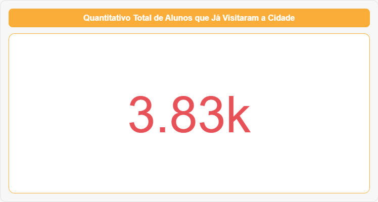
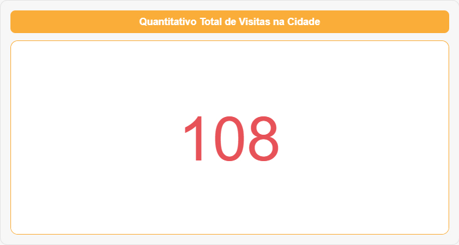
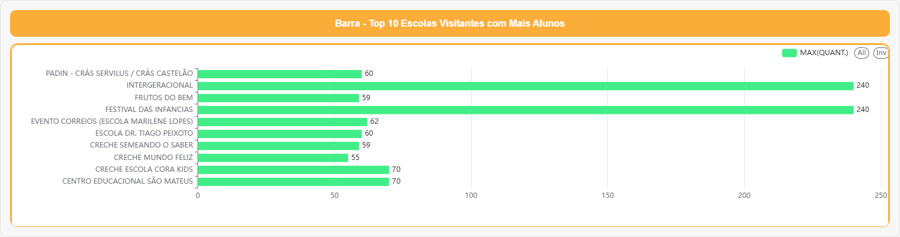
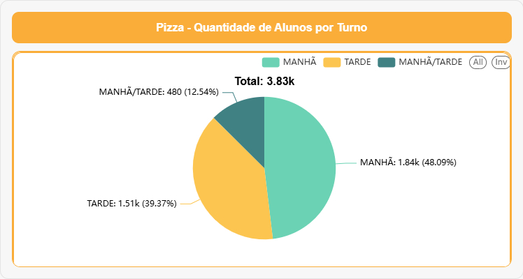
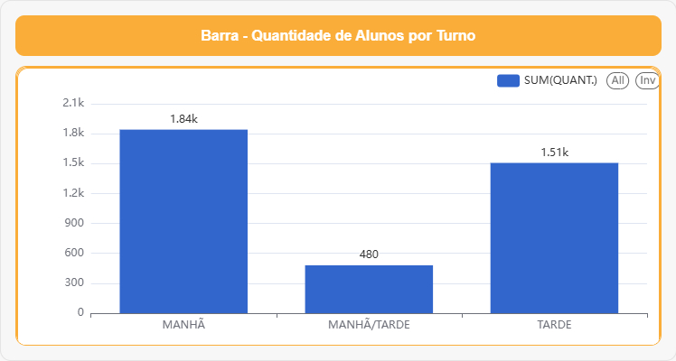
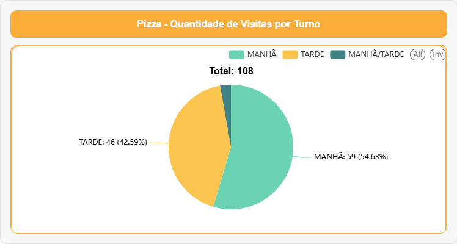
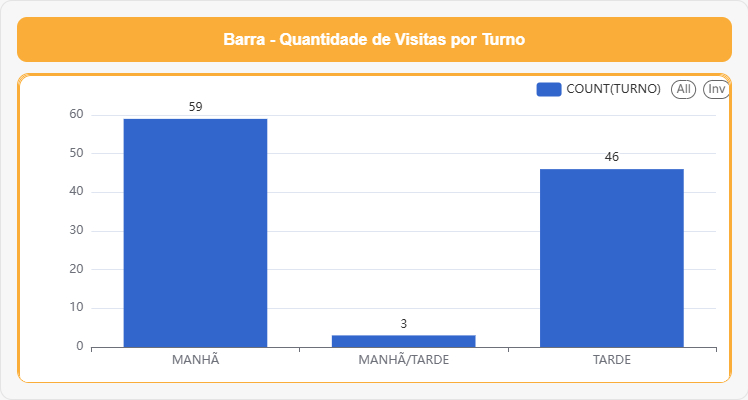

# 📊 Dashboard – Visitas à Cidade da Criança (Página 2)

## 📌 Indicadores em Destaque (Cards)

### Quantitativo Total de Alunos que Já Visitaram a Cidade

### Quantitativo Total de Visitas na Cidade

---

## 🏆 Top 10 Escolas Visitantes com Mais Alunos

---

## 🕒 Distribuição por Turno – Quantidade de Alunos

### Pizza – Quantidade de Alunos por Turno

### Barra – Quantidade de Alunos por Turno

---

## 🕒 Distribuição por Turno – Quantidade de Visitas

### Pizza – Quantidade de Visitas por Turno

### Barra – Quantidade de Visitas por Turno

### Barra – Visitantes por Dia e por Turno
.png)

### Barra – Número de instituições visitantes por Dia
.png)

---

## 📝 Reflexões a partir do dashboard

- Como esses dados podem orientar o planejamento de novas visitas?  
- Há grupos / territórios que ainda não estão sendo alcançados?  
- Como fortalecer a **equidade** no acesso à Cidade da Criança?  
- Que parcerias podem ser estimuladas a partir desses números?
