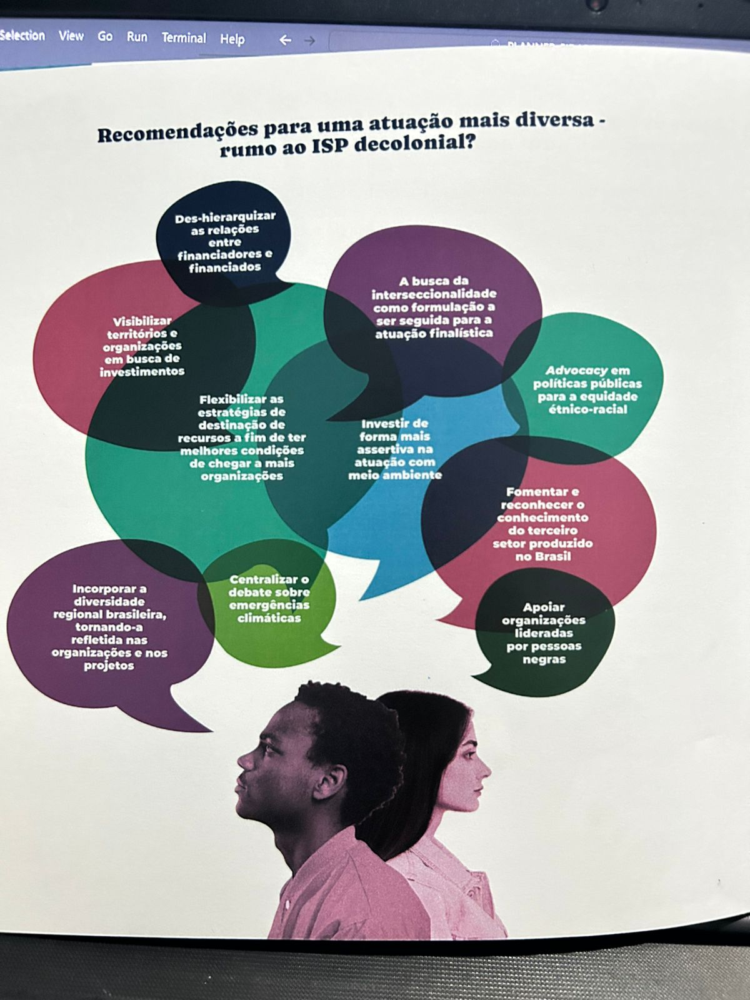

# 📊 Dashboard – Visitas à Cidade da Criança (Página 2)

## Opiniões dos Professores - Avaliação Subjetiva

| Iniciais | Escola                               | Texto avaliativo                                                            |
| -------- | ------------------------------------ | --------------------------------------------------------------------------- |
| MM       | CEI Maria Aglaê                      | A diversidade de atividades, cada criança pode escolher o que mais desejava |
| EMRL     | CEI JOSÉ DIAS MACEDO                 | As crianças puderam brincar e se divertir.                                  |
| AC       | CE Dias Macedo                       | Acolhimento excelente                                                       |
| L        | CEI JOSÉ DIAS MACEDO                 | Tudo muito organizado                                                       |
| IF       | Semente Montessori Educação Infantil | A qualidade dos materiais, organização e disposição dos mesmos.             |
| JV       | UniChristus                          | Recepção de todos os funcionários                                           |
| L        | CEI FRANCISCO EURIVÁ MATIAS          | A organização                                                               |
| DB       | CEI Francisco Eurivá Matias          | -                                                                           |
| RC       | CEI Francisco Eurivá Matias          | Os materiais disponíveis para exploração das crianças.                      |
| MJ       | Faculdade Unichristus                | O atendimento                                                               |
| JV       | Cidade da Criança                    | Tudo, na verdade. A cidade é encantadora.                                   |
| J        | Cidade da Criança                    | Os espaços temáticos                                                        |
| MIBMT    | CEI ALAÍDE AUGUSTO DE OLIVEIRA       | A organização dos espaços                                                   |
| -        | CEI ALAIDE AUGUSTO DE OLIVEIRA       | As casas super equipadas.                                                   |
| -        | CEI Alaíde Augusto de Oliveira       | -                                                                           |
| GKFDS    | Creche Sonho de Criança II           | A recepção calorosa e simpática da senhora Tereza.                          |
| FRDA     | Creche Sonho de Criança              | -                                                                           |

## Inspiração para colocar os dados acima:

### Barra – Visitantes por Dia e por Turno

> OBS: cada balão terá o texto do professor, as suas iniciais e o nome da escola
