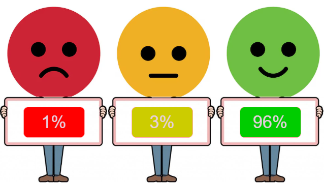

# 📊 Dashboard – Visitas à Cidade da Criança (Página 3)

### Avaliação Subjetiva por parte dos alunos

| Indicador avaliado              | Resultado | Interpretação                                        |
| ------------------------------- | --------- | ---------------------------------------------------- |
| Total de crianças participantes | 3.828     | Alto alcance e adesão qualificada ao circuito.       |
| Escolas participantes           | 108       | Forte capilaridade e integração com redes de ensino. |
| Avaliação “Ótimo”               | 96%       | Experiência altamente satisfatória e encantadora.    |
| Avaliação “Neutro”              | 3%        | Margem esperada; perfis em adaptação.                |
| Avaliação “Ruim”                | 1%        | Rejeição mínima, reforçando a qualidade geral.       |

# Importância da Avaliação das Crianças nos Circuitos Sensoriais da Cidade da Criança

A avaliação das crianças sobre suas experiências nos circuitos sensoriais é um componente essencial para que a Cidade da Criança funcione como **política pública viva**, construída **com** as crianças e não apenas **para** elas. Abaixo, estão organizados os principais motivos dessa importância.

---

## 1. Coloca a criança como protagonista da política pública

Ao perguntar às crianças como elas se sentiram, o que mais gostaram, o que deu medo, cansaço ou encantamento, a gestão:

- **Reconhece a criança como sujeito de direitos e de opinião**, não apenas como “participante” passiva.
- Se alinha à **Convenção sobre os Direitos da Criança**, que garante o direito de ser ouvida em tudo o que lhe diz respeito.
- Fortalece uma cultura de **escuta qualificada da infância** na formulação, monitoramento e ajuste das ações.

Exemplo: quando **96% das crianças avaliam o circuito como “ótimo”**, isso mostra não só satisfação, mas **coerência entre a proposta do circuito e o universo infantil**.

---

## 2. Gera evidências para melhorar o desenho dos circuitos

A opinião das crianças responde perguntas que só elas conseguem responder com precisão:

- Os circuitos estão **desafiadores na medida certa** (nem difíceis demais, nem “bobos” demais)?
- Os percursos são **claros, seguros e interessantes** do ponto de vista delas?
- Existem estações que são:
  - ignoradas,
  - cansativas,
  - confusas ou repetitivas?
- Há momentos em que elas se sentem:
  - com medo,
  - sobrecarregadas,
  - desmotivadas?

Com isso, a avaliação infantil permite:

- **Ajustar o circuito**  
  (ordem das estações, mediação dos educadores, tempo de permanência em cada ponto).
- **Criar ou priorizar novas experiências** inspiradas no que mais mobiliza curiosidade, riso, exploração e perguntas.

---

## 3. Conecta experiência sensorial com desenvolvimento integral

Os circuitos sensoriais não são apenas “brincadeiras”: eles articulam **corpo, emoções, linguagem, imaginação e convivência**.

A avaliação das crianças ajuda a enxergar se:

- Elas estão conseguindo **nomear e expressar sentimentos** (medo, surpresa, alegria, curiosidade, nojo, encantamento).
- O circuito favorece **autonomia e exploração**, ou se tudo é excessivamente guiado pelo adulto.
- Há espaço para:
  - **criar narrativas**,
  - **perguntar**,
  - **repetir atividades**,
  - **experimentar de outro jeito**.

Assim, a avaliação contribui para verificar se o circuito está realmente promovendo **desenvolvimento integral**, e não apenas entretenimento.

---

## 4. Alimenta monitoramento, gestão e prestação de contas

Do ponto de vista da gestão pública, a escuta das crianças é um insumo valioso para:

- Mostrar que o equipamento não apenas atende **muitas crianças**, mas atende **bem**.
- Complementar os dados quantitativos (ex.: número de crianças e escolas atendidas) com dados qualitativos, como:
  - percentual que achou “ótimo”, “bom” ou “regular”,
  - quais espaços marcaram mais,
  - quais sentimentos aparecem com frequência.
- Fortalecer relatórios e apresentações para:
  - Prefeitura,
  - conselhos de direitos,
  - órgãos parceiros,
  - financiadores e apoiadores.

Em síntese, a avaliação infantil ajuda a demonstrar que a Cidade da Criança é uma **política baseada em evidências**, e que essas evidências incluem a voz das crianças.

---

## 5. Revela desigualdades e pontos cegos

A escuta qualificada das crianças também permite identificar:

- Se há grupos que se sentem **menos à vontade ou menos incluídos**, como:
  - crianças com deficiência,
  - crianças mais tímidas,
  - crianças muito sensíveis a ruídos e estímulos.
- Se alguma parte do circuito é **pouco acessível ou excludente**.
- Se determinadas experiências funcionam melhor para algumas **faixas etárias** do que para outras.

A partir disso, é possível fazer ajustes que tornem a Cidade da Criança cada vez mais:

- **Inclusiva**  
- **Equitativa**  
- Coerente com a perspectiva de **direitos humanos da infância**.

---

## 6. Gera pertencimento e memória afetiva

Quando a criança é convidada a avaliar sua experiência:

- Ela percebe que **sua opinião importa** para a cidade.
- Cria um vínculo de **pertencimento** com o equipamento (“a cidade me escuta”).
- A visita deixa de ser apenas um passeio e passa a ser uma **memória afetiva de cidadania**.

Essa dimensão simbólica é tão importante quanto a pedagógica: a criança se reconhece como **sujeito de direito e voz** em um equipamento público.

---

## Frase de síntese para relatório, slide ou dashboard

> **“A avaliação das crianças sobre os circuitos sensoriais é fundamental porque coloca a infância no centro da decisão pública, gera evidências para qualificar o circuito, monitora o impacto real da política e garante que a Cidade da Criança seja construída com as crianças, e não apenas para elas.”**
