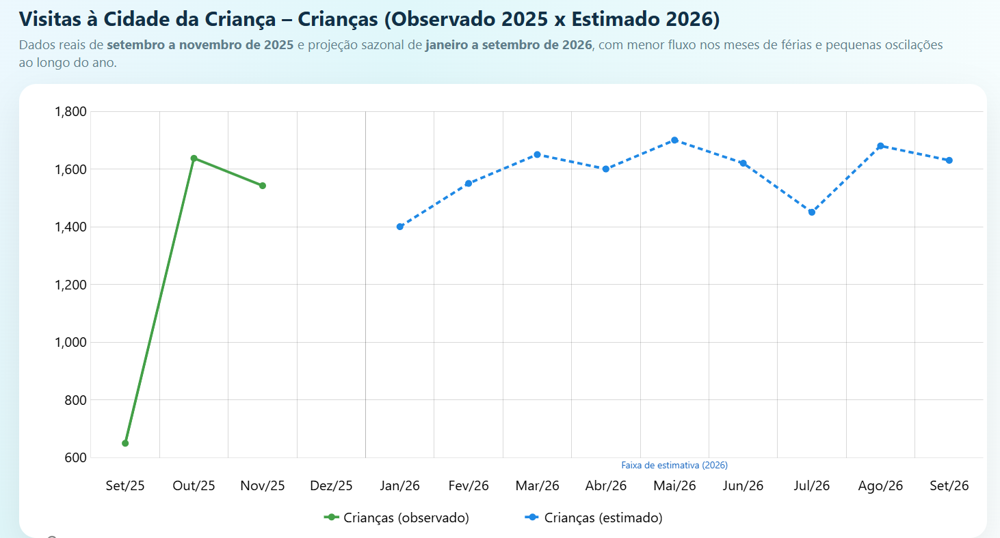

# 📊 Dashboard – Visitas à Cidade da Criança (Página 4)

## Estimativas para 2026:

| Indicador              | 2025 (3 meses) | Média mensal estimada | Projeção 2026 (12 meses) *se mantido o mesmo ritmo* |
| ---------------------- | -------------- | --------------------- | --------------------------------------------------- |
| Crianças participantes | 3.828          | 1.276                 | **15.312**                                          |
| Escolas participantes  | 108            | 36                    | **432**                                             |
| Satisfação “Ótimo”     | 96%            | —                     | Tendência de manter patamar ≥ **95%**               |
| Avaliações “Neutro”    | 3%             | —                     | Mantida como **margem de adaptação**                |
| Avaliações “Ruim”      | 1%             | —                     | Mantida em **patamar residual (≈1%)**               |

>“Mantido o ritmo observado entre setembro e novembro de 2025, a Cidade da Criança poderá alcançar, em 2026, cerca de 15.312 >crianças e 432 escolas, preservando um índice de satisfação em torno de 96% de avaliações ‘Ótimo’.
>Esses números projetam um forte impacto educacional, territorial e afetivo, consolidando a Cidade da Criança como política >pública estruturante e contínua da primeira infância em Fortaleza.”

### Estimativa quantidade de alunos mensal

